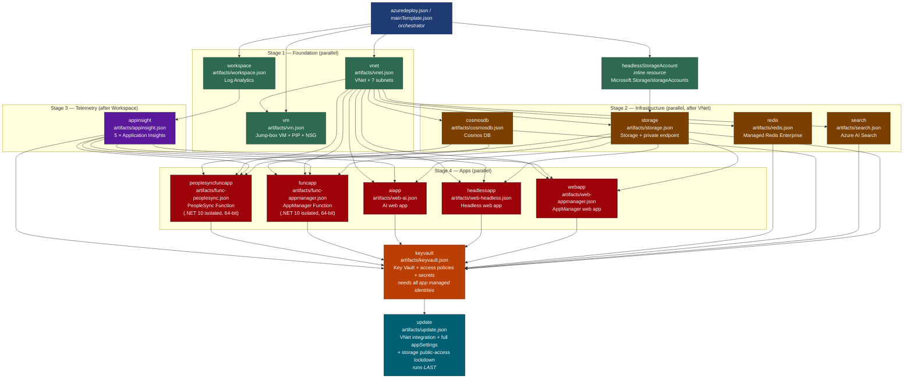
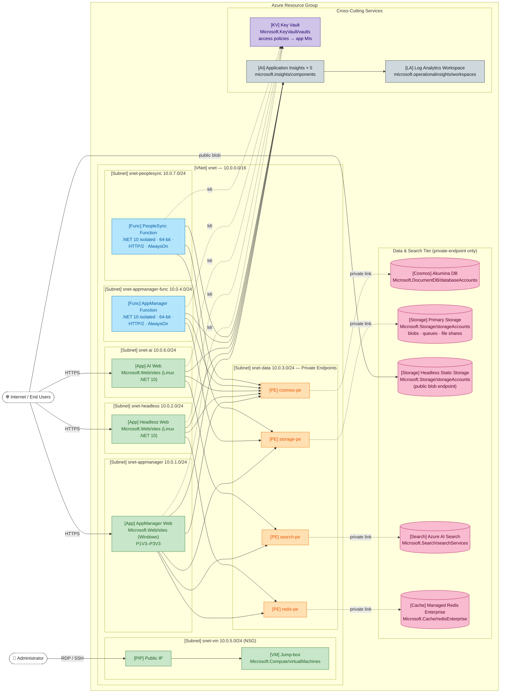

# Akumina Web Solution 7.x — Azure Deployment

ARM templates for deploying the full Akumina Web Solution 7.x stack on Azure, including AppManager, Headless, AI, and PeopleSync applications with all supporting infrastructure.

---

## Resources Deployed

| Resource | Type | Description |
|---|---|---|
| AppManager Web App | `Microsoft.Web/sites` | Primary Akumina AppManager application (Windows) |
| Headless Web App | `Microsoft.Web/sites` | Akumina Headless rendering application (Linux, .NET 10) |
| AI Web App | `Microsoft.Web/sites` | Akumina AI application (Linux, .NET 10) |
| AppManager Function App | `Microsoft.Web/sites` (functionapp) | Akumina background processing function app (Windows, .NET 10 isolated, PremiumV3, 64-bit, HTTP/2, AlwaysOn) |
| PeopleSync Function App | `Microsoft.Web/sites` (functionapp) | Akumina PeopleSync integration function app (Windows, .NET 10 isolated, PremiumV3, 64-bit, HTTP/2, AlwaysOn) |
| Virtual Network | `Microsoft.Network/virtualNetworks` | Isolated VNet with 7 dedicated subnets |
| Key Vault | `Microsoft.KeyVault/vaults` | Secrets for AppManager, Headless, and AI app configurations |
| Storage Account | `Microsoft.Storage/storageAccounts` | Blob/queue/file storage for Akumina content |
| Azure Cosmos DB | `Microsoft.DocumentDB/databaseAccounts` | NoSQL database for Akumina containers |
| Azure AI Search | `Microsoft.Search/searchServices` | AI Search for Akumina content indexing |
| Azure Managed Redis | `Microsoft.Cache/redisEnterprise` | Enterprise-tier Redis cache |
| Application Insights (×5) | `microsoft.insights/components` | Per-app telemetry for all five applications |
| Log Analytics Workspace | `microsoft.operationalinsights/workspaces` | Shared workspace for Application Insights |
| Virtual Machine | `Microsoft.Compute/virtualMachines` | Windows jump-box / admin VM |

---

## Virtual Network Subnets

| Subnet | Default Name | Default CIDR | Purpose |
|---|---|---|---|
| AppManager | `snet-appmanager` | `10.0.1.0/24` | AppManager web app VNet integration |
| Headless | `snet-headless` | `10.0.2.0/24` | Headless web app VNet integration |
| Data | `snet-data` | `10.0.3.0/24` | Private endpoints (CosmosDB, Storage, Redis, Search) |
| AppManager Func | `snet-appmanager-func` | `10.0.4.0/24` | AppManager function app VNet integration |
| VM | `snet-vm` | `10.0.5.0/24` | Virtual machine subnet (NSG protected) |
| AI | `snet-ai` | `10.0.6.0/24` | AI web app VNet integration |
| PeopleSync | `snet-peoplesync` | `10.0.7.0/24` | PeopleSync function app VNet integration |

---

## Files

```
web-solution-7.x/
├── azuredeploy.json              # Main orchestration template (AzureInstall / CLI deploy)
├── azuredeploy.parameters.json   # Parameter values for CLI deployment
├── mainTemplate.json             # Azure Marketplace main template
├── createUiDefinition.json       # Azure Marketplace UI wizard definition
└── artifacts/
    ├── appinsight.json           # Application Insights for all 5 apps
    ├── cosmosdb.json             # Azure Cosmos DB account
    ├── func-appmanager.json      # AppManager function app + plan
    ├── func-peoplesync.json      # PeopleSync function app + plan
    ├── keyvault.json             # Key Vault + access policies + secrets
    ├── redis.json                # Azure Managed Redis Enterprise
    ├── search.json               # Azure AI Search service
    ├── storage.json              # Primary storage account
    ├── update.json               # Post-deploy: VNet integration + app settings
    ├── vm.json                   # Virtual machine + public IP + NSG
    ├── vnet.json                 # Virtual network + all subnets
    ├── web-ai.json               # AI web app (Linux) + app service plan
    ├── web-appmanager.json       # AppManager web app + app service plan
    ├── web-headless.json         # Headless web app + app service plan
    └── workspace.json            # Log Analytics workspace
```

---

## Deployment

### Azure CLI

```bash
az deployment group create \
  --resource-group <your-resource-group> \
  --template-file azuredeploy.json \
  --parameters @azuredeploy.parameters.json
```

### Azure Marketplace (Portal)

Use `mainTemplate.json` and `createUiDefinition.json` as the Marketplace offer package.

### Test as a Service Catalog Managed Application (no Marketplace publishing required)

The same three assets that ship with the Marketplace offer — `mainTemplate.json`, `createUiDefinition.json`, and the `artifacts/` folder — can be packaged and tested end-to-end in the Azure Portal as a **Service Catalog Managed Application Definition**. This exercises the exact UI wizard, parameter mapping, and linked-template fan-out that the Marketplace listing will use, without any Partner Center submission.

**1. Build the package zip**

The zip must contain `mainTemplate.json` and `createUiDefinition.json` at its root, with the `artifacts/` folder preserved alongside them so that the `relativePath` references in `mainTemplate.json` (e.g. `artifacts/vnet.json`) resolve correctly.

```powershell
cd AzureInstall/web-solution-7.x
Compress-Archive -Path mainTemplate.json, createUiDefinition.json, artifacts -DestinationPath app.zip -Force
```

**2. Upload the zip to a publicly readable blob**

```powershell
$ctx = New-AzStorageContext -StorageAccountName <stagingStorageAccount> -UseConnectedAccount
Set-AzStorageBlobContent -File app.zip -Container <stagingContainer> -Blob app.zip -Context $ctx -Force
# Generate a read SAS valid long enough to create the definition
$sas = New-AzStorageBlobSASToken -Container <stagingContainer> -Blob app.zip -Permission r -ExpiryTime (Get-Date).AddHours(4) -Context $ctx
$packageUri = "https://<stagingStorageAccount>.blob.core.windows.net/<stagingContainer>/app.zip$sas"
```

**3. Create the Managed Application Definition**

In the Azure Portal: **Create a resource → Service Catalog Managed Application Definition**, then provide:

- **Package file URI**: the SAS URL from step 2
- **Lock level**: `ReadOnly` (or `None` for testing)
- **Authorizations**: at least one principal (your user/group) with the `Owner` or `Contributor` role

Or via CLI:

```bash
az managedapp definition create \
  --name "akumina-web-7x-test" \
  --resource-group <definition-rg> \
  --location <region> \
  --display-name "Akumina Web 7.x (test)" \
  --description "Service Catalog test of Akumina Web Solution 7.x" \
  --lock-level ReadOnly \
  --package-file-uri "$packageUri" \
  --authorizations "<principalId>:<roleDefinitionId>"
```

**4. Deploy from the definition**

Open the new definition in the portal and click **Deploy from definition**. The portal renders `createUiDefinition.json` exactly as it would for a Marketplace customer, then submits `mainTemplate.json` with all linked artifacts. Use a fresh resource group per test run so cleanup is a single delete.

**5. Iterate**

After fixing templates, repeat steps 1–2 (re-zip and re-upload), then either:
- update the existing definition with `az managedapp definition update --package-file-uri "$packageUri"`, or
- delete and recreate it.

> **Tip:** The `createUiDefinition.json` sandbox below is the fastest way to iterate on UI/wizard changes alone. Use the Service Catalog flow when you need to validate the full deployment, including linked templates and `outputs` mapping.

---

## createUiDefinition Sandbox

To preview and test the `createUiDefinition.json` wizard in the Azure Portal sandbox:

1. Open the sandbox: [https://portal.azure.com/#view/Microsoft_Azure_CreateUIDef/SandboxBlade](https://portal.azure.com/#view/Microsoft_Azure_CreateUIDef/SandboxBlade)
2. Paste the contents of `createUiDefinition.json` into the editor.
3. Click **Preview** to walk through the wizard and validate outputs.

---

## Deployment Architecture

The deployment is orchestrated via linked ARM templates. Key sequencing:

1. **VNet** — created first; all apps depend on it
2. **Infrastructure** — Storage, CosmosDB, Redis, Search, Workspace deployed in parallel
3. **App Insights** — one workspace-linked resource per application
4. **Web/Function Apps** — `web-appmanager`, `web-headless`, `web-ai`, `func-appmanager`, `func-peoplesync` deployed in parallel after infra
5. **Key Vault** — created after all apps exist (requires managed identity principal IDs)
6. **Post-Deploy Update** (`update.json`) — runs last; applies VNet integration, KeyVault URI settings, storage lockdown, and the full constant app settings for both function apps

### Function App Settings Split

To avoid duplication and respect provisioning order, function app `appSettings` are split across two locations:

- **`func-appmanager.json` / `func-peoplesync.json`** — only bootstrap settings: ARM expressions (`listKeys` for storage/Cosmos), parameter references (App Insights), and `WEBSITE_CONTENT*` keys required at function creation time. Runtime stack (`FUNCTIONS_EXTENSION_VERSION=~4`, `FUNCTIONS_WORKER_RUNTIME=dotnet-isolated`) is also seeded here so the host can boot.
- **`update.json`** — all constant settings (queue names, collection names, trigger disabled flags, cron schedules, processing tunables, `WEBSITE_CONTENTOVERVNET`, KeyVault-backed connections such as `AkuminaConnection` and `AIAkuminaConnection`). Applied after VNet integration so KeyVault references resolve correctly.

### Cross-Service Private Connectivity

In addition to private endpoints into the data tier, the **AI Search service** opens a [Shared Private Link](https://learn.microsoft.com/azure/search/search-indexer-howto-access-private) to **Cosmos DB** (`groupId: Sql`). This lets Search indexers reach Cosmos over the Microsoft backbone without exposing Cosmos to the public network. The link is provisioned by `artifacts/search.json` as a `Microsoft.Search/searchServices/sharedPrivateLinkResources` child resource and forces `search` to depend on `cosmosdb`.

### Storage File Shares

`artifacts/storage.json` provisions **two** Azure Files shares — one per function app — so each function has its own isolated content share when running with `WEBSITE_CONTENTOVERVNET=1`:

| Share | Consumer |
|---|---|
| `<funcAppName>cs` | AppManager Function App |
| `<peoplesyncFuncAppName>cs` | PeopleSync Function App |

---

## Deployment Flow Diagram

The diagram below shows linked-template deployments orchestrated by `azuredeploy.json` / `mainTemplate.json`, the `dependsOn` ordering between them, and the output references that flow from one stage to the next.



### Stage Summary

| Stage | Linked Templates | Notes |
|---|---|---|
| **0 — Inline** | `headlessStorageAccount` | Created directly by the orchestrator before any linked deployment; provides public Blob endpoint suffix consumed by `storage`. |
| **1 — Foundation** | `vnet`, `workspace`, `vm` | All independent of one another; can run in parallel. `vm` depends on `vnet` for its subnet. |
| **2 — Infrastructure** | `storage`, `search`, `redis`, `cosmosdb` | All depend on `vnet` (private endpoints into `snet-data`). `storage` additionally depends on the inline headless storage account. |
| **3 — Telemetry** | `appinsight` | Depends on `workspace`; outputs instrumentation keys + connection strings consumed by every app. |
| **4 — Apps** | `webapp`, `headlessapp`, `aiapp`, `funcapp`, `peoplesyncfuncapp` | Each depends on `storage`, `appinsight`, `vnet`. The two function apps additionally depend on `cosmosdb`. All emit `SystemAssigned` managed identities. |
| **5 — Secrets** | `keyvault` | Depends on every app deployment so that managed-identity principal IDs are available for access policies; also pulls connection strings from `storage`, `search`, `cosmosdb`, `redis`. Grants `Get`/`List` secret permissions to all five app managed identities (AppManager web, Headless, AI, AppManager function, **PeopleSync function**). |
| **6 — Update** | `update` | Runs last. Applies VNet integration to all apps, writes the full constant `appSettings` for both function apps (queues, triggers, cron, KeyVault-backed connections), and locks down storage public network access. |

---

## Runtime Topology

The diagram below shows the **runtime network topology** of the deployed solution: the VNet, its seven subnets, which workload lives in each subnet, the private-endpoint links into the data tier, and the cross-cutting services (Key Vault, App Insights, Log Analytics).

> Mermaid does not currently render Azure stencil icons reliably on GitHub. Each node is therefore drawn as a labeled box with its Azure resource type and a short symbol prefix (`[VNet]`, `[App]`, `[Func]`, `[PE]`, `[KV]`, etc.) so the topology stays readable wherever the README is viewed.



### Topology Legend

| Symbol | Azure Resource Type | Notes |
|---|---|---|
| `[VNet]` | `Microsoft.Network/virtualNetworks` | Single isolated VNet, `10.0.0.0/16` |
| `[Subnet]` | `…/virtualNetworks/subnets` | 7 subnets, one per workload + one for private endpoints |
| `[App]` | `Microsoft.Web/sites` (web) | Regional VNet integration into per-app subnet |
| `[Func]` | `Microsoft.Web/sites` kind=`functionapp` | PremiumV3, .NET 10 isolated, 64-bit, HTTP/2, AlwaysOn |
| `[PE]` | `Microsoft.Network/privateEndpoints` | Co-located in `snet-data`; private DNS auto-registration |
| `[Cosmos]` / `[Storage]` / `[Search]` / `[Cache]` | Data tier | Public network access disabled by `update.json`; reachable only via PE |
| `[KV]` | `Microsoft.KeyVault/vaults` | Access policies grant `get/list` to each app's system-assigned managed identity |
| `[AI]` / `[LA]` | App Insights + Log Analytics | All five App Insights components flow into one workspace |
| `[VM]` / `[PIP]` | Jump-box VM + Public IP | NSG-protected admin access only |

> When you import the deployment into a tool that supports Azure icons (Visio with the Microsoft Azure stencil set, draw.io / diagrams.net "Azure 2019" shape library, or Lucidchart's Azure shapes), substitute each box by dragging the matching shape. The topology, edges, subnet membership, and private-endpoint placement remain unchanged.

---

## Parameters Reference

| Parameter | Description |
|---|---|
| `webName` | AppManager web app name |
| `webSku` | AppManager app service plan SKU (P1V3–P3V3, I1V2–I3V2) |
| `headlessName` | Headless web app name |
| `headlessSku` | Headless app service plan SKU |
| `aiName` | AI web app name (Linux) |
| `aiSku` | AI app service plan SKU |
| `funcAppName` | AppManager function app name |
| `funcAppSku` | AppManager function app service plan SKU (P1V3–P3V3, default P1V3) |
| `peoplesyncFuncAppName` | PeopleSync function app name |
| `peoplesyncFuncAppSku` | PeopleSync function app service plan SKU (P1V3–P3V3, default P1V3) |
| `storageAccountName` | Storage account name |
| `storageAccountSku` | Storage replication type |
| `keyVaultName` | Key Vault name |
| `keyVaultSku` | Key Vault tier (Standard / Premium) |
| `aiSearchName` | Azure AI Search service name |
| `aiSearchSku` | Azure AI Search tier |
| `redisCacheName` | Azure Managed Redis instance name |
| `redisSku` | Redis SKU (e.g. `Balanced_B5`, `MemoryOptimized_M10`) |
| `cosmosDBAccountName` | Cosmos DB account name |
| `cosmosDbCapacityMode` | `Throughput` or `Serverless` |
| `workspacesLogName` | Log Analytics workspace name |
| `vnetName` | Virtual network name |
| `vnetPrefix` | VNet address space (e.g. `10.0.0.0/16`) |
| `snet*Name` / `snet*Prefix` | Per-subnet name and CIDR (7 subnets) |
| `vmName` | Jump-box VM name |
| `adminUsername` | VM administrator username |
| `adminPassword` | VM administrator password (min 12 chars) |
| `webAppPackageUrl` | AppManager deployment package URL |
| `headlessAppPackageUrl` | Headless deployment package URL |
| `aiAppPackageUrl` | AI app deployment package URL |
| `funcAppPackageUrl` | AppManager function app deployment package URL |
| `peoplesyncFuncPackageUrl` | PeopleSync function app deployment package URL |

---

## AppManager Secret (`appVal`) Configuration

The `appmanager` Key Vault secret (`appVal`) is composed in `mainTemplate.json` / `azuredeploy.json` and consumed by the AppManager web app at startup. In addition to the core connection settings (Cosmos, Search, Redis, Storage, Tenants directory), the following PeopleSync, schema, and search-tuning properties are included:

| Property | Default | Purpose |
|---|---|---|
| `SupportsPeopleSyncAzureFunction` | `true` | Enables PeopleSync function-based sync path |
| `PeopleSyncAzureFunctionQueue` | (queue name) | Storage queue used by PeopleSync triggers |
| `AkEnvironment` | `DEV` | Logical environment label |
| `AkDomain` | `domain.com` | Tenant DNS domain |
| `PeopleDataEntityPrefix` | `akad` | Prefix applied to people-data entities |
| `FieldNameCasing` | `Mixed` | Field name casing convention |
| `StandardV2Tokenizer` | (analyzer name) | Search analyzer for general text |
| `AsciiFoldingAnalyzer` | (analyzer name) | Diacritic-folding analyzer |
| `AsciiFoldingKeywordAnalyzer` | (analyzer name) | Diacritic-folding keyword analyzer |
| `KeywordAnalyzer` | (analyzer name) | Exact-match keyword analyzer |
| `VectorSearch` | (config name) | Vector search profile/configuration |

---

## PeopleSync Function — Identity & Secrets

The PeopleSync function app is provisioned with a **SystemAssigned managed identity** and is granted `Get` / `List` secret permissions on the AppManager Key Vault via a dedicated access policy in `artifacts/keyvault.json`. This allows the `AIAkuminaConnection` app setting (added in `update.json`) to resolve through a Key Vault reference to the AI app secret URI at runtime.
